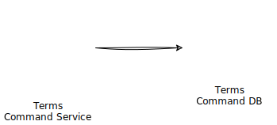

<h1 align="center">Micro Ecommerce</h1>

<div align="center">

[]()
[](/LICENSE)

</div>

<p align="center">
    Demo ecommerce application using various tech stacks
</p>

## 🧐 About <a name = "about"></a>

This project is a demo ecommerce application using MSA(Microservice Architecture) and various tech stacks.

The main purpose of this project is to experiment with various tech stacks, system / software architecture, design patterns and to learn the best practice of using them.

Tech stacks, system / software architecture chosen for this project are popular or used widely in the industry.

## ⛏️ Built Using <a name = "built_using"></a>

### SCM (Source Code Management)

<a href="https://git-scm.com">
    
</a>
<a href="https://github.com">
    
</a>
<a href="https://pre-commit.com">
    
</a>

<a href="https://editorconfig.org">
    
</a>

### CI / CD (Continuous Integration / Continuous Delivery)

<a href="https://github.com/features/actions">
    
</a>
<a href="https://www.mend.io/renovate">
    
</a>

### Infrastructure
<a href="https://kubernetes.io">
    
</a>
<a href="https://www.rancher.com">
    
</a>
<a href="https://k3s.io">
    
</a>
<a href="https://helm.sh">
    
</a>
<a href="https://istio.io/latest/">
    
</a>
<a href="https://cert-manager.io">
    
</a>
<a href="https://www.keycloak.org">
    
</a>

## 🏁 Getting Started

These instructions will get you a copy of the project up and running on your local machine for development and testing purposes.
See [deployment](#deployment) for notes on how to deploy the project on a live system.

### Prerequisites

1. Install [**Rancher Desktop**](https://rancherdesktop.io/)

    Rancher Desktop will install and configure the following tools:
    - [**Helm**](https://helm.sh/)
    - [**Docker**](https://www.docker.com/)
    - [**Kubectl**](https://kubernetes.io/docs/tasks/tools/install-kubectl/)

2. Install [**Skaffold**](https://skaffold.dev/docs/install/)

3. Install [**pre-commit**](https://pre-commit.com/#install)

### Installing / Running locally

1. Clone this repository

    ```bash
    git clone https://github.com/gudfhr95/micro-ecommerce
    cd micro-ecommerce
    ```

2. _(Optional)_ Install **pre-commit** hooks

    ```bash
    pre-commit install
    ```

3. Config `/etc/hosts`

    Add the following entries to your `/etc/hosts` file:

    ```bash
    127.0.0.1 httpbin.micro-ecommerce.com
    127.0.0.1 keycloak.micro-ecommerce.com
    ```

4. Install **Cert-Manager CRDs**(Custom Resource Definitions)

    Cert-Manager has a dependency on CRDs that need to be installed onto a Kubernetes cluster before Cert-Manager itself can be installed.

    ```bash
    kubectl apply -f https://github.com/cert-manager/cert-manager/releases/download/v1.11.1/cert-manager.crds.yaml
    ```

5. Run **Skaffold**

    ```bash
    skaffold dev
    ```

    All helm dependencies and charts will be installed automatically by Skaffold.

6. Access to **httpbin**

    ```bash
    open https://httpbin.micro-ecommerce.com/status/418
    ```

    Then you will see the following response:

    ```
    -=[ teapot ]=-
       _...._
     .'  _ _ `.
    | ."` ^ `". _,
    \_;`"---"`|//
      |       ;/
      \_     _/
        `"""`
    ```

7. Access to other services

    You can access other services by using the following URLs:
    - **Keycloak**: https://keycloak.micro-ecommerce.com

## 🖼️ Diagrams

### EventStorming


### Context Map


### System Architecture



### Microservices

#### Terms

- SnapE


- Aggregate


- ERD


## ✍️ Authors <a name = "authors"></a>

- [@gudfhr95](https://github.com/gudfhr95)

## 🎉 Acknowledgements
